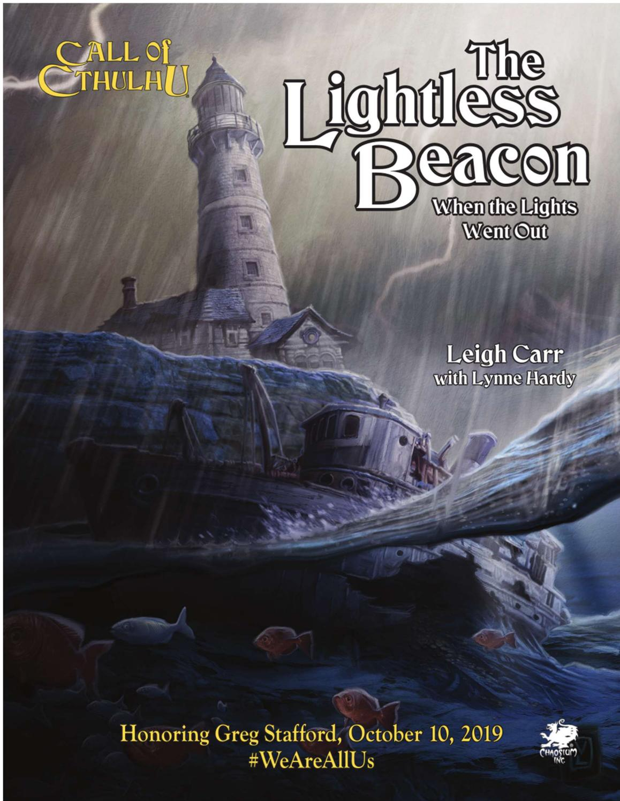

# 无光的灯塔

# The Lightless Beacon

# 致谢

作者

Leigh Carr & Lynne Hardy

编辑

Lynne Hardy

封面插图

Victor Leza

内页插图

Victor Leza

地图和材料

Matt Ryan

版面编排

Nicholas Nacario

校对

Keith Mageau

COC 创意总监

Mike Mason

特别鸣谢

向试玩者 Hannah Butler, Emma Catan, Rebecca Catan, Lu, Jules Pai, Samantha Sloan 致以特别鸣谢。

致谢申明

无光的灯塔由 Leigh Carr 写就，Lynne Hardy 修改并添加内容。

译 ads 校 狗头

# 目录

简介 ... .5  
模组概述 . 5  
背景 ..  
导入 .. .8  
起点：波浪起伏的水面 . .8  
熄灭的灯塔 .. .9  
两栖类攻击 . . 18   
结局 .. . 18  
怪物档案 .. . 19

# 简介

欢迎你游玩无光的灯塔，这是今年第一个格雷格·斯塔福德日(Greg Stafford Day)的 COC 模组。这天是为了庆祝格雷格一生的成就，和他在 1975 年建立的混元社而设立的。希望你能找来些朋友，一起享受模组。

模组设定在 1926 年四月十二日，航标岛上，马萨诸塞州罗克波特市附近。这是为新手 kp 和 pl 专门设计的入门模组，但老手也可以享受。模组仅持续一小时，正适合 没 有 时 间 玩 更 长 模 组 的 玩 家 ， 或 是 正 在 熟 悉COCTRPG 的玩家。

模组附带（让你能够马上游玩而设置的）四个预设调查员，是独立冒险，也可以作为新战役的开端，快速聚起陌生人，再推进克苏鲁神话的世界中。有等待解开的谜题，亟需克服的威胁，还有对黑暗中真正恐怖的一瞥：优秀COC 冒险的关键要素都齐了！

# 进行游戏

主持前，你需要熟悉 COC 守秘人核心规则书或者COC新手包里的7版规则。

之后，需要通读模组，并对时间点和特定场景做好笔记，以尽可能顺利主持游戏。笔记可以很简单，像在草稿纸上用几条关键点列出重要事件，更精细些也好——用最适合你的办法就行。如果你刚刚起步，也许该多尝试，看看什么最契合你的团风。

如果要把模组供四人游玩，时长一小时，第 5 页上的模组结构给出了推荐时间安排。如果不满四名 pl，第 6 页上的关于调查员部分同样建议了该使用哪些预设调查员。本模组推荐最少两名 pl 游玩。模组可以轻易容纳下四个以上 pl，不过游戏时间可能会延长至二或三小时。

如果 pl 想自己创建调查员，也是个不错的主意！确保你熟知他们的技能描述，好让模组体验最大化，并从预设调查员的背景故事中寻找提示，把新调查员和模组联系起来。在导入时给 pc 身处模组之中的理由能给 pl 更多动力参与进情节中，也更有望让他们得到乐趣。

确保你在游戏开始之前打印出角色卡1，让 pl 选择——这也有助于他们代入故事。除此之外，只需要一些骰子，几支铅笔，还有一些草稿纸就万事齐备了！

# 模组概述

在这个模组里，调查员作为倒霉乘客，于 1926 年四月十二日周一，满月之夜，同船前往马萨诸塞州罗克波特市。航标岛上灯塔故障，让船撞上小岛附近的岩石沉没了，迫使你们搭乘一艘小救生艇，在愈发狂暴的风雨中驶向航标岛寻求庇护。不幸，你们无意间涉足混种深潜者和它们邪恶同伙的追讨行动，更大的危险将要降临。调查员是会幸存下来，亲口讲述自己的发现，还是会屈从于四面而来的深海威胁？

# 模组结构

如果你计划在一小时2结束模组的话，接下来列出了时间安排供参考。如果多于四个 pl 参与，或者 pl 希望自创调查员（而不使用预设角色），再或者你想要主持较长的游戏的话，那么每个部分的用时可能会是这里提到的两倍或以上。

 导入：kp 简述第 8 页导入里的模组设定，介绍预设调查员。如果要自创调查员的话，就介绍最适合的职业。如果场上有新手 pl，或者要使用可选燃运规则（COC 守秘人核心规则书，第 99 页，或者本模组第 6 页上的燃运简介部分）的话，那么 kp 可能还需要简单列出游戏中会用到的规则。pl 选择或者创建好调查员后，应该向众人简单介绍。  
起点：波浪起伏的水面：（5-10 分钟后开始）沉船之后，调查员划着小艇航过波浪起伏的水面，来到航标岛上矗立的灯塔附近。他们也许会发现水下沉有一艘乘船，曾经计划驶向印斯茅斯小镇。  
熄灭的灯塔：（10-40 分钟后开始）调查员探索这座小岛，或进入灯塔。无论如何都会发现一具死尸。这具人类尸体也许能使他们再找到怪异的两栖类生物尸体。调查过灯塔书房内的笔记和信件，也许就能解开谋杀起因之谜。

 两栖类攻击：（40-55 分钟后开始）怪异的两栖类生物攻击调查员，想要找回金币。外界可能会向调查员伸出援手，但他们能否收到援助取决于之前的行动。  
 后日谈：模组以简短的后日谈结尾，之后 kp 就可以回答 pl 的问题了。

如果你把模组时长限定为一小时来主持的话，应确保每个部分都在分配的时间内结束。你应当据此来控制模组节奏，并且必要时把 pl 引向关键点和主要目标。同样，尝试给每个 pl 同等的注意力，好让众人都有机会一展身手。

模组早期，pl 可以分头行动：一组人搜索小岛的同时另一组进入灯塔。不过这样，跑完模组就可能要花不止一小时了。那些在岛上漫游，寻找印斯茅斯金币的类鱼生物（两栖类攻击，第 18 页）出现之后，调查员就能会合。调查员也可以选择直面敌人，单打独斗，取决于你想要的团风。

为了揭露航标岛上的真相，搜寻线索很重要，模组就意在强调这点，另一点是一般 COC游戏中战斗的危险性。

# 关于调查员

无光的灯塔含四个预设调查员。每个人都因为或公或私的理由乘船来到罗克波特，并卷进航标岛事件中。

如果 pl 想要使用预设调查员，而不自创角色的话，kp 需要保证他们先仔细阅读角色卡，再开始游戏。这样他们就能活用角色卡中的信息在游戏中扮演。预设调查员都是性别中立的：男性，女性，还是非二元性别，都由 pl来决定。pl 还需要为 pc 取名。

最后，如果 pl 使用预设调查员的话，需要设定幸运值。让 pl 骰 3D6，把结果乘以五，在角色卡上的幸运栏中圈出相应数字。

# 古董商

作为数年前侥幸逃过牢狱之灾的前罪犯，古董商现如今已经洗心革面。最近他的老共犯乔治·卡西迪来信，这位航标岛上的灯塔看守人问他，是否还在买卖偷窃得来的奇珍异宝。

特质：忠诚，但有限度。他谨慎而多疑——黑历史被发现的代价太大了。

# 燃运简介

如果你把无光的灯塔与 COC 新手包一起使用的话，那么可能会忽略可选燃运规则（COC 守秘人核心规则书，99页）。对于贯用的流线型规则来说，它是个有趣的扩展。如果想要使用燃运规则，此处有简介。在骰运不佳或是剧情需要推进时，燃运规则十分有用，在短模组中尤是，建议开启此拓展规则。

如果要使用此拓展规则，那么玩家的幸运值就不仅限于骰点了，他们现在可以花费幸运值来调整检定结果。通常玩家会燃运来把失败的检定结果变为成功的，但也可以选择改变成功等级——把普通成功变为困难成功，或是把困难成功变为极难成功（在战斗中尤其有用）。玩家可以通过燃运，也就是消耗所需的幸运值，来调整一次技能检定（不包括理智和幸运检定）的结果，把失败变为成功，或者更高等级的成功。

举个例子，你的侦查有 $40 \%$ ，但骰出了 50（一次失败），可以花费十点幸运点数改掷骰结果为 40，让它从失败变为成功。角色幸运值各有不同，一回合花这些可能多了点，但在某些场合中，例如挖出线索或是避开一顿揍，这么做可能很明智。调查员现有的幸运值是燃运的唯一限制。但燃运是把双刃剑：幸运值用过就不复存在，且之后过幸运要用现有的，也就是更低的值做检定，而非初始幸运值！战役当中有恢复幸运值的办法，但是本模组中不需要。

尽管可以燃运，但还是得对玩家仁慈一点：不要在无关紧要的骰点中鼓励玩家燃运，把幸运点留到真正需要的时候再燃。幸运点并非万能，不能用它调整孤注一掷的结果，也不能调整武器故障、伤害检定、理智检定、或是幸运检定的结果。

动机：弄清卡西迪又惹了什么麻烦，看看能不能帮他再次摆平。

# 调查局探员

调查局探员近期在马萨诸塞州热门的东海岸航线上监视非法活动。他现在正前往罗克波特，接受同事沃伦·托马斯的指示。对方目前以灯塔看守人迈克尔·特纳的身份，在航标岛秘密调查。

. 特质：有些神经紧张和警惕。这个任务的某方面就是让他不安。  
 动机：从卧底同事那拿到报告，好让上级把自己重新分配去不那么可怕的地方。

# 海洋生物学家

海洋生物学家近期正在完成一篇论文，研究罗克波特迷人的海洋环境。只差最后一点数据，就能把论文交给波士顿大学了。因此，他踏上了旅途。

特质：外貌魅力十足，但他决心证明自己的内在也同样优秀。  
. 动机：完成论文，说不定还能发现证据，证明有新的海洋物种，再用自己的名字命名！

# 艺术家

年轻时，艺术家游手好闲，但现在找到了真正的使命。他正前往罗克波特寻找作画灵感，就当是沿东部沿海地区旅行计划的一环。

特质：爱炫耀，有些古怪，但谁也骗不了他。  
 动机：找到能唤起艺术激情的东西。扮演需要保持 思想开放，灵感从何时何地而来永远是未知数！

# 玩家不足四人？

如果只有两名 pl，并且想用预设调查员的话，推荐选择古董商和调查局探员。有三名 pl，海洋生物学家就可以作为备选。本模组虽然不供单人游玩，但如果只有一名 pl，那么推荐选择调查局探员，并把估价和驾驶（船）技能都提升至 $50 \%$ 。方案二是让玩家一人控制古董商和调查局探员。

# 额外调查员

如果玩家多于四人，那么需要多准备调查员。预设调查员都要乘船前往罗克波特，额外加入的也不例外，甚至可以是乘务人员。虽然船长或船舶工程师职业提供的技能就够多了，包括斗殴、导航、船舶驾驶、以及维修能力，但多些职业选择范围还是好的。船员还可能有些黑历史，让他们踏上航海生涯，从事现在的职业，甚至在海上不期而遇波涛之下的生物……谁知道呢？

如果玩家们宁愿自己创建调查员，那只需要理由搭乘这艘船前往罗克波特就行了。如果能和航标岛上的灯塔看守有关系的话，那就更好了，比如笔友关系或者是亲属关系，甚至可以是来轮班的灯塔看守人。如果玩家已经设计好了调查员，那么让他们乘上埃塞克斯号，于 1926 年四月十二日在愚角触礁就行了。

推荐技能包括：估价，艺术与手艺（绘画和素描），电气维修，射击（手枪），急救，聆听，锁匠，机械维修，医学，博物学，神秘学，驾驶（船只），侦查，潜行，追踪。

# 背景

1926 年二月十二日，暴风雨袭击了愚角，就在马萨诸塞州罗克波特附近。一艘无标识船只运载达贡邪教徒的黄金，从南部海域出发，前往印斯茅斯。它以航标岛灯塔作为导航，避开寻常贸易路线，监管者没发现。不幸的是，

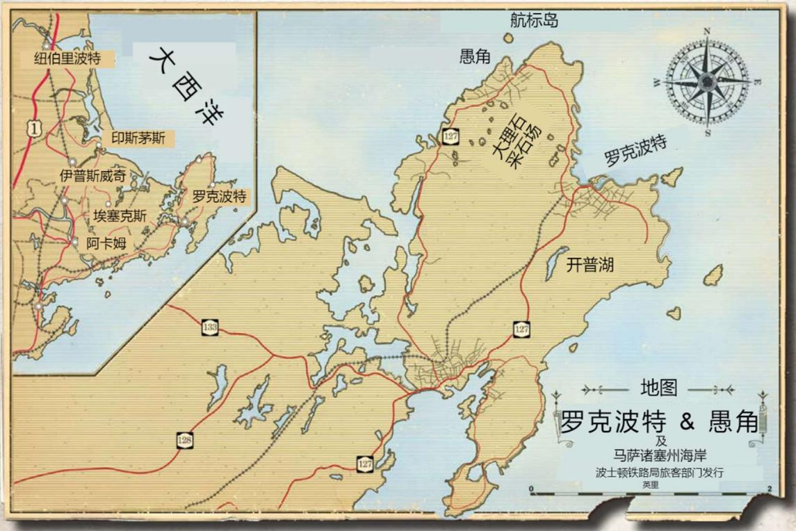

灯塔照明灯出了故障，船只一头扎入附近的岩石堆，在船体上扯开一个大洞，还在锅炉里引发了小而毁灭性的爆炸。之后船就沉了，它在此经过的痕迹几乎荡然无存。

事故发生之后，印斯茅斯的达贡奥秘修道会就小心翼翼，尝试从沉船上回收黄金。沉船靠近航标岛和联通罗克波特的热门航线，让回收变得更难了。虽然成事居多，但还是遗漏了一些金币，有些冲上了大陆沿岸，另一些则冲到了航标岛北岸上。在沉船事故后一天，岛上的灯塔看守人乔治·卡西迪意外找到了一枚金币。他在海滩边淘金，坚持不懈，不放过任何一处，历时一个月，最终收集了数量可观的印斯茅斯黄金。他也一直在古董市场上给这些古怪黄金估价，好创造一笔巨额存款。

直到现在，邪教徒都以为航标岛上没有人找到金币，因此忽视了灯塔里的人。他们指责岛上的看守人迟迟不修灯塔，但也觉得没有必要为沉船的损失报仇。灯塔对走私来说太宝贵了，不要干扰它的日常运作才好。

邪教徒收到卡西迪的来信，找他们帮忙识别金币并为其估价。自此，事态就转变了。卡西迪接二连三来信，要不了多久，无疑就会让调查局怀疑，因此邪教徒决定找回这些金币。他们安排在四月十二日潜入小岛，新月升起的夜里格外黑暗，对进攻有利。

两名混种深潜者受命之后，在岛上初步侦查，抓住了正在逃跑的塞缪尔·史密斯。他是卡西迪的同事，在岛上目睹了太多怪事。审问中，史密斯咬定岛上其余两人不难解决，混种深潜者也就信以为真。倒霉的史密斯，被逼供后就惨遭杀害。之后，在 1926 年四月十二日傍晚，其中一个混种深潜者带着凶恶的两栖生物（幼徒）来到岛上，清剿其余灯塔员工，追查卡西迪窝藏的金币。另一个混种深潜者则在愚角待机，时刻准备支援同伴。

调查员登岛时，幼徒已经追上了卧底迈克尔·特纳，并把他杀害。同时，岛上的混种深潜者和另一群幼徒则去追卡西迪。在灯塔灯房里，卡西迪和这些怪物搏斗了一番，杀了两个幼徒和混种深潜者之后身亡。一发流弹打碎了镜头和灯泡，让附近海域陷入黑暗。

没有了混种深潜者领头，剩下的幼徒根本不懂怎么回到愚角寻求支援，就这样在岛上漫游，找寻其余金币。

# 导入

向玩家朗读或复述：

现在是1926 年四月十二日，晚上八点十五分左右。航标岛上，临近马萨诸塞州愚角，那照亮这片危险而多岩

水域的灯塔，在大约十五分钟前熄灭了。你们前往罗克波特搭乘的埃塞克斯号也因此受到影响。这艘船只载着乘客和货物，一头撞上水中岩石，船身受到重创。

船要沉了。船上备有许多小划艇式的救生船，船员催你们上去，边安顿你们边说，最优解是向航标岛前进。暴风雨快来了，他们吃不准你们是否能抵达大陆。在风雨来临之前，你们应该刚好能抵达岛上。

除此之外，船员没有多说什么，就这样把你们推了出去。眼前的水域一片漆黑、暗潮涌动，能指明方向的，只有灯塔轮廓的底部闪烁的微光。

如果要用预设调查员的话，应向玩家简单描述，让每人选择。给玩家充足的时间阅读预设人物卡，并解答问题。别忘了让玩家骰幸运值（ $3 \mathrm { D } 6 ^ { \ast } 5 $ ），和调查员姓名一起写到人物卡上。如果玩家要用原创人物，那就协定调查员身处前往罗克波特的船上的理由。

万事具备，让玩家互相简单介绍自己的角色，或是揭露前往罗克波特的隐藏动机。现在你已经准备好开始冒险了。

# 起点：波浪起伏的水面

一片漆黑中，调查员的划艇撞到了坚实的物体。附近的沙坝上嵌着一些扭曲的废铁，而表层之下藏着更多。守秘人此时应要求知识和侦查的联合检定。

 成功的知识检定会表明，这些废铁可能是一部分船体，虽然调查员最近没听到过这附近有什么沉船消息。  
成功的侦查检定会表明，上面没有可供识别的标记。表面的藤壶为数不多，损毁痕迹也相对较少，可以判断，这些废铁应该在这没放多久。  
. 如果两个检定都成功了，那么玩家得到所有上述信息。

要从废墟中解放划艇，不撞上附近的岩石，需要驾驶（船只）检定成功。大失败或是孤注一掷失败会让船身破洞，船开始沉没，调查员只能游向岸边。守秘人可以要求游泳检定，但通常调查员的游泳技能不高，可能会在上岸之前淹死。小岛离调查员较近，建议让他们在水中挣扎之后就浑身湿透地上岸，瑟瑟发抖，满身挫伤。这样的话，如果游泳技能检定成功，可以使调查员更快上岸，失败则

意味着水流肆意玩弄了他们，才冲他们上岸。

调查员始终能清楚地看见灯塔和小屋一体的建筑底部传来微弱的亮光。

# 熄灭的灯塔

航标岛的北岸有个小码头。调查员可以驶出黑暗到达码头，或者游过去。这是小岛北部最安全的登陆点。码头前方是一条肮脏的小径，被高高的杂草包围。能听到附近机械装置发出的微弱声响。机械维修或者电气维修检定成功会表明，是发电机的。

沿小径走，不多久就能到达灯塔小屋的入口。小屋的前门半掩，透过门缝能看见屋内透出微弱而恒定的光。门的两侧各有一扇窗户，都被薄薄的窗帘遮住，温暖的光线从左边的窗后映出，似乎是在邀请你们进屋。沿小径往前，能到达灯塔的后方。

侦查检定成功表明，小屋大门前有泥泞的小脚印，像是动物的。在脚印之下，有清晰的靴印，一部分被它上层的脚印遮盖住。博物学或是科学：（生物学或动物学）检定成功得出，这些小脚印像是鸭子留下的；困难成功表明，脚印不同寻常，与已知物种均有差异。

调查员检查脚印时，海上的风浪越来越大了。水手警告过的暴风雨正从海上呼啸而过。雨水降下，发出啪嗒啪嗒的声响。如果调查员不尽快去追踪脚印，雨水冲刷，它可能会永远消失。

守秘人笔记：此时，调查员可能分头行动，一队去追查脚印（如果跟踪脚印，见下方），另一队进小屋（灯塔小屋，第 10页）。幼徒的进攻迫在眉睫（两栖类攻击，第18 页），因此不必觉得非阻止分线不可。一旦屋外的人找到并检查过特纳的尸体（灌木丛中，见右），就可以安排这次攻击，让调查员都回到小屋集合。如果玩家分头行动，确保兼顾两队玩家，避免其中一队长时间无事可做。不管在哪分线，现在就分还是在灯塔内，模组用时都会超过一小时。

# 如果跟踪脚印

追踪检定成功表明，这串似乎属于动物的脚印沿小径通向灌木丛，靴印则从小屋前门通向树林中。它在脚印之下，那它必然是先出现在地面上的。靴印最终导向迈克尔·特纳的尸体，就藏在附近的树林里（灌木丛中，见下方）。

沿小屋旁的人行小道走，不多久就会来到岔路口。一条支路通往另一扇门——这次是厨房。主干道经过灯塔，通往简陋的户外淋浴室（一个浴缸，上方有临时组装的淋浴头和木质遮蓬，水来自遮蓬上方的雨水箱）和户外厕所。再沿路往前走，穿过灌木丛，就到了南岸码头。

离开小道，绕到灯塔后面，能看见两间棚屋。较小那间里面有台运行的发电机，还有大量汽油和木柴。棚屋屋顶有个洞，雨滴正从中穿过，落到下方的电气设备上。调查员能在隔壁的工作室里找到修好屋顶所需的材料，但还是需要相关艺术与手艺检定（例如木工）成功，或是机械

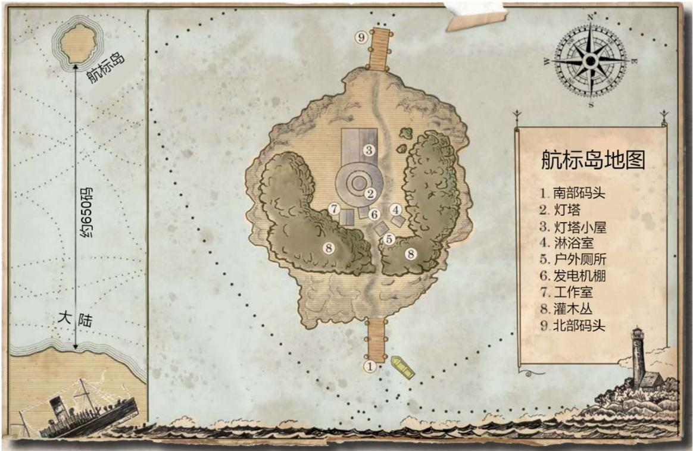

维修检定困难成功才能修复屋顶。

更大的第二间棚屋显然是个工作室，里面有各种材料、机械零部件、工具、油灯以及一张工作台。调查员可以使用屋子里的工具快速制作临时武器。现场制作的临时武器有 1D4 的伤害（再加上伤害加值）。屋里除了钉子和波纹铁板，还有把锤子可以修补发电机房屋顶。还有无数螺丝刀和凿子，可以打开桌子里上锁的抽屉（书房，第 11 页）。

# 制造压力

航标岛上绝不只有调查员。记住，无数幼徒正在岛上游荡，寻找金币。不需要马上就让它露面，但可以提及调查员听到与狂风声毫不相干的沙沙声、瞥见怪形、真切地感到有什么正监视自己，借此来制造压力，吓唬他们。如果你实在想要求聆听和侦查的联合检定，可以这么做。但即便调查员听到什么，看到什么，那东西也会在他们跟上去之前就离开。

# 灌木丛中

调查员沿小径追踪脚印，用不了多久就会绊上一具尸体——迈克尔·特纳，面目全非、血肉模糊，内脏四分五裂，被扯离体内，踩进泥地。一旁地上搁了盏破碎的提灯。人显然没死多久。

尸体会让调查员失去 $1 / 1 \mathrm { { D 4 } + 1 }$ 点理智。调查局探员发现尸体失去 1/1D6 点理智。

# 急救检定或是医学检定成功揭露以下信息：

 普通成功表明，特纳的身体可能被某种动物撕开，尸体上有奇怪的牙印和爪印。  
困难成功表明，特纳去世没多久：不到一小时。  
 极难成功表明，皮肤里深埋了几根小针。

发现小针后，困难博物学或者科学（生物学或动物学）检定成功得出，它像是某种动物刺毛，很可能有毒。

搜查尸体，会发现隐蔽处有个空枪套，以及一枚调查局徽章，表明此人的真名是沃伦·托马斯。如果调查局探员在场，且有意确认信息，可以知道此信息正确无误。当然，他可能还没向其他人透露自己是政府调查员，希望暂时保密此事。一地内脏里缠了把史密斯和韦森.38 特别版六发左轮手枪。枪膛里只剩五发子弹能打，还有个空弹壳。不管特纳被什么攻击，只逃了一轮，就被击倒了。左轮如命中目标，能造成 1D10 点伤害。

# 南部码头

调查员继续沿这条被人踩出来的小径穿过森林，发现了另一座老旧码头。一条划艇，漆成黄色，系在码头上。远处小镇传来灯光，西南方向能看见罗克波特有名的花岗岩采石场。

侦察检定成功和书房（第 11 页）里找到的望远镜表明：

 普通成功会让调查员注意到一个小光源（愚角沿岸的那个混种深潜者持有的提灯）。  
困难成功会发现大陆码头停泊有另一艘黄色划艇。  
. 极难成功表明，两岸的黄色划艇不论是设计还是尺寸，几乎都一模一样。

守秘人笔记：游戏更长，就可以让调查员驶向大陆，去面对混种深潜者，或许还能找到倒霉的塞缪尔·史密斯的尸体。对于一小时的游戏来说，还是把调查员限制在岛上更好。也许风浪越发狂暴，摧毁了码头上的黄色划艇，又或者浪实在是太高了，这艘划艇小而脆弱，不足以载你们去大陆。如果能找台无线电来求救会更好？调查员如果在解开谜题、解决幼徒之后才来到南部码头，这艘划艇当然可以作为逃生手段。但在彼岸等待的混种深潜者……

# 灯塔小屋

半掩的前门后，有条宽阔的过道，两旁各有两扇房门。这条走廊通往四个房间：书房，宿舍，厨房，以及食物贮藏室。走廊尽头是旋转楼梯，蜿蜒向上，通向灯塔的服务室。

房间看起来都安装了电灯泡，但只有书房的灯还亮。希望调查员看过或听过正常工作状态下的发电机后，见到书房的灯光，会疑惑为什么灯塔有电力，但还是熄灭了

# 走廊

走廊现在没有照明，亮光传出书房，有望吸引调查员。打开走廊的灯，众人最先注意到的会是门旁的三个衣帽钩。一个钩子上面挂了件破旧防水外套，两双橡胶套鞋放在衣帽钩下方的浅塑料盒子里，盒子旁边有双室内鞋。防水外套旁的衣帽钩上挂了两盏提灯；还有个空钩子，暗示缺盏灯。

打开灯，侦查检定成功会表明走廊地板里嵌着两颗子弹——没开灯则需要极难成功才能发现。手枪射击检定或是智力检定成功会表明，子弹是某人站在曲折的阶梯上方

# 疯狂的调查员

别忘了：如果调查员一次性损失五点或以上的理智，又或者在模组过程中累计丧失了五分之一或以上的初始理智，那么会获得临时疯狂或者不定期疯狂。为了让这些数字更好记，下面给出了预设调查员的初始理智值，和到达不定期疯狂要失去的理智值，还包括了推荐的疯狂发作以及不由自主的行动，不管是在临时疯狂中，还是在不定期疯狂中，都可以使用。每次疯狂发作持续 1D10 轮。

# 古董商

 理智：50   
不定期疯狂：丧失 $1 0 +$ 理智时。  
不由自主的行动：松开自己拿的东西，任它掉落。  
 疯狂发作：妄想症；确信每个人都知道自己的过去，一有机会就要把自己移交警方。“你们为什么用那种眼神看我，啊？你知道什么？告诉我！告诉我！”

# 调查局探员

 理智：65  
不定期疯狂：丧失 $^ { 1 3 + }$ 理智时。  
不由自主的行动：（如果持枪的话）朝任意方向开枪，或是把手边最近的东西扔向任意目标。  
 疯狂发作：局面已变得难以忍受，调查局探员准备开溜。“我再也受不了了。 这个地方。 还有你们这些人。 我要走，谁也阻止不了我！”

# 海洋生物学家

 理智：60  
不定期疯狂：丧失 $^ { 1 2 + }$ 理智时。  
不由自主的行动：原地僵住。  
 疯狂发作：除了哽咽地报出海洋生物的学名以外，什么都做不了。“美洲龙虾、 大西洋蓝蟹、 黑鲈、 大青鲨、石首鱼..”

# 艺术家

理智：60  
不定期疯狂：丧失 $^ { 1 2 + }$ 理智时。  
不由自主的行动：昏厥一回合。  
疯狂发作：取决于引起疯狂发作的东西，获得鱼类恐惧症或是深海恐惧症。

几层打出的。

点点血迹从厨房地板通向楼梯——发现此事就过理智检定（0/1 理智损失）——还有三枚金币，相当大，就这么被遗弃在地上。估价检定成功会表明，硬币是纯金打造。一面刻的图像似乎是某种方尖碑，另一面则铺满咒印和花纹，古怪而令人不安。神秘学检定成功表明，调查员对咒印的深层含义一无所知，但它似乎和南部海域的宗教部落使用的咒印很相似。相关艺术与手艺检定或者博物学检定成功能指出，花纹暗含某种和水相关的主题。

守秘人笔记：调查员如果有估价、神秘学、艺术与手艺或是博物学技能的话，可以把这些技能组合检定。在组合检定中成功的技能，会提供相应信息。如果调查员在某部分检定中失败了，其余调查员如有同样技能，随时可以再做尝试。

# 书房

书房中央有三把扶手椅。大厅走廊上有扇通往厨房的门，这里也有。除了扶手椅以外，房内还有张桌子，放在通往大厅的门左侧，一张折叠式办公桌放在厨房门的墙边。

两张桌子旁边都放了一把木椅。办公桌旁那把现在躺在地板上；智力检定成功会表明，坐过的人突然起身，把椅子撞倒在地。

桌上有几本航海故事，一本关于鸟的书，灯塔维修指南，一根烟斗和一荷包烟丝，一副望远镜，一本素描簿，几支铅笔，水彩颜料，画笔和画纸。

桌上还有一幅水彩画，放在一摞叠放整齐的画作旁，像是近期作成。它意图展示一扇窗户：一个黑影，双眼大睁，它的视线从窗玻璃后射来，恶意十足。调查员可以轻易认出，窗户和桌子旁边的是同一扇。观看画作触发理智检定（0/1 理智损失）。博物学或者科学（生物学或动物学）检定成功表明，黑影的双眼圆胖而丑陋，像是长在头的两侧，和鱼或是青蛙的结构很相似。与艺术与手艺相关的检定（如绘画或素描）成功表明，这幅画作是匆匆作成的——它的笔触不如桌上其它画作那样精巧谨慎。

调查员浏览众多叠放整齐的水彩画时，又被另一幅画吸引。画面重点描绘了附近的灌木丛、灯塔和一两座其它小建筑。通向灌木丛的小径前方一片漆黑，只能看清一个男人的轮廓。这幅画不像第一幅画，它标注了日期：1926年二月十四日。素描簿里有幅潦草素描，与此画相关，上面写着前一天的日期，但是没有素描和第一幅画有关。

房间另一头的折叠式办公桌合上了，但没有上锁。打开就能看见有个马克杯，里头还剩半杯咖啡，尚有余温。还有许多文具：信封，邮票，信纸，瓶装墨水及钢笔。台面上剩下的空间摊着金币估价发票，很是杂乱，是罗克波特的古董店开的；金额从两美金到五美金不等，都开具于

1926 年二月末。如果调查员在走廊里找到了金币的话，估价检定成功就能意识到，只有一些店家开价合理，其余的显然打算占顾客便宜。

在一个大金币册子下面，压着几封信，是从更遥远的古董店、图书馆馆长、以及大学那寄来的。每封信开头都写“亲爱的卡西迪先生”，随后附上一段致歉，解释寄信人无法判定信中描述金币的起源。然而他们都盼望看到实物，好详加分析。

图书馆使用检定成功表明，大部分信件都按时间顺序排列。第一封标注了 1926 年三月八日，最后一封标了1926 年四月二日。最后一封信来自纽伯里波特学会的安娜·蒂尔顿小姐（材料：无光 1）。

办公桌也有两个抽屉。左边的开着，锁孔里断了把钥匙——抽屉里有个空木盒，里面的绿丝绒衬布凹陷，形状像把左轮手枪。抽屉里还散着六颗子弹。右边的抽屉锁着锁匠检定成功可以开锁。力量检定成功也可以破锁，还能用厨房刀或是外面的工作室（如果跟踪脚印，第 9 页）里的螺丝刀和凿子撬锁。抽屉里面有乔治·卡西迪的日记（材料：无光 2）。封皮上画了一座方尖碑，十分潦草——和金币上的相同（见过金币就会知道此事）。日记中最后一次记录唐突地中断了，就好像卡西迪的写作过程被打断了一样。

守秘人笔记：古董商能认出卡西迪的笔迹，发觉信件中涉及自己（二月十六号的记录）。

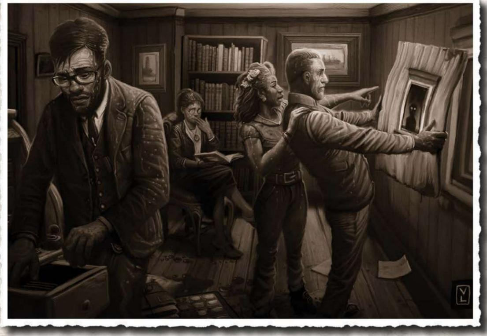

# 航标岛灯塔

霍华德&罗伯森…· 建筑师

惠角.·· ·马萨诸塞州

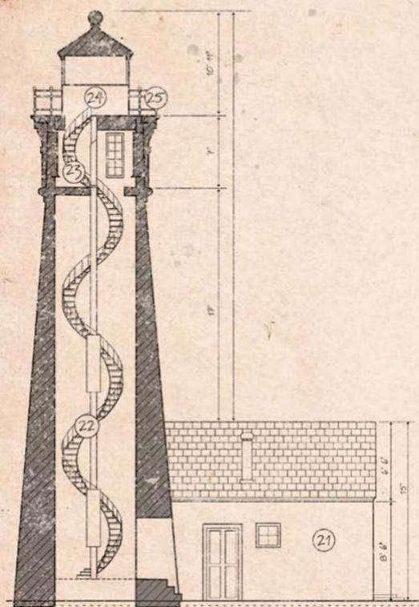  
东侧立面

<table><tr><td colspan="2">侧视图</td></tr><tr><td>编号</td><td>设施</td></tr><tr><td>21</td><td>小屋外墙</td></tr><tr><td>22</td><td>楼梯</td></tr><tr><td>23</td><td>服务室</td></tr><tr><td>24</td><td>灯房</td></tr><tr><td>25</td><td>灯房外走廊</td></tr></table>

平面图  

<table><tr><td>编号</td><td>设施</td></tr><tr><td>1.</td><td>前门</td></tr><tr><td>2.</td><td>宿舍</td></tr><tr><td>3.</td><td>走廊</td></tr><tr><td>4.</td><td>书房</td></tr><tr><td>5.</td><td>厨房门</td></tr><tr><td>6.</td><td>厨房</td></tr><tr><td>7.</td><td>食物贮藏室</td></tr><tr><td>8.</td><td>灯塔</td></tr><tr><td>9.</td><td>通往灯房的楼梯</td></tr><tr><td>10.</td><td>艺术家的桌子</td></tr><tr><td>11.</td><td>写字台</td></tr><tr><td>12.</td><td>印斯芬斯金币</td></tr></table>

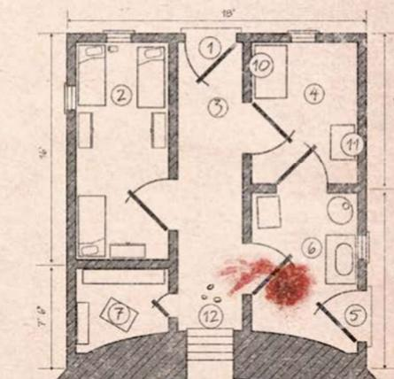

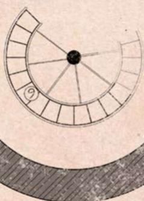  
  
楼层规划

# 纽伯里波特学会

纽伯里波特埃塞克斯郡马萨诸塞州

一九二六年四月二日

亲爱的卡西迪先生，

感谢您今年二月二十八日寄出的信件。

我确实认出了您所描述的金币，至少认出了它的装饰风格。我们纽伯里波特博物馆里有件藏品，来源相同。我觉得您的金币来自附近的印斯茅斯，并且只有那个落后小镇的居民能告诉您金币的真正价值一一起码是对他们而言的价值。

但是，如果您珍视自己的灵魂的话，我极力告诫您，不要和那个地方的人来往。与印斯茅斯镇打交道向来没有好处。作为代替，一旦能确认是真品，纽伯里波特学会十分愿意用市价向您购买金币。

如果您愿意择日尽早到协会博物馆来拜访我，那么我可以安排估价师检查金币，好商定合理的出售价格。

卡西迪先生，我再次力劝您不要和印斯茅斯人谈起您的发现。这对大家来说都好。

谨上

安娜·蒂尔顿小姐

材料：无光 2

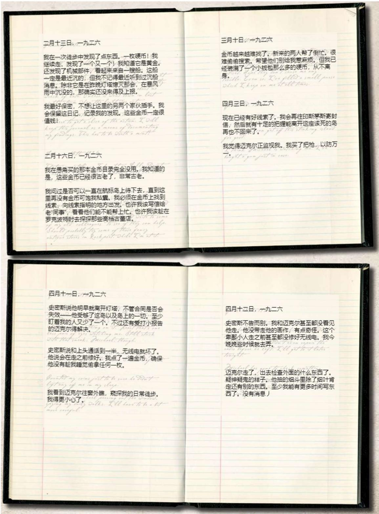

# 厨房

厨房洗碗槽里有几只脏盘子和一只汤锅，室内还有一张桌子和三把椅子。出口为三扇门：分别通向外面，走廊和书房。远处角落里放着一个小火炉，烧木柴用，一旁的壁炉前有把水壶，有些发热。一把椅子摔坏了，旁边的地上有一小滩血。

智力检定成功表明，椅子可能作为武器使用过。急救或医学检定成功表明，血迹还呈新鲜状，在最近一小时里留下；困难成功表明，血液有些不对劲，极难成功则表明这可能不是人血。

厨房抽屉里有唯一一把可用的厨房刀，十分锋利。调查员可能想要把它当武器（1D3 伤害，加上任何伤害加值），或者用它撬开办公桌里的上锁抽屉。

# 宿舍

宿舍里有三张铺好的床。房间一角整齐地堆着一大叠书。房间里还有三个大橱柜，每个都放着肥皂、毛巾、新寝具以及额外的毛毯。特纳和卡西迪的橱柜里还有一些衣物和个人物品，而史密斯的橱柜里只有家用织品和毛巾。

侦查检定成功能让调查员在特纳的床垫里找到一枚金币、六颗子弹以及一本袖珍笔记本（材料：无光 3）。调查局探员能获得一枚奖励骰，他知道同事可能在哪藏东西。特纳在附近水域发现无标识船体后，就被安插在航标岛上，作为秘密调查员负责追踪热门航线上的非法船只。

材料：无光 3

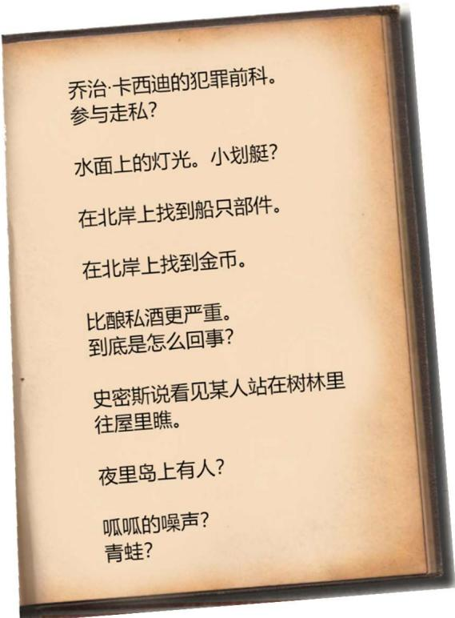

# 食物贮藏室

灯塔的食物贮藏室里排满了柜子，整齐地摆放了各种风干的、罐装的以及腌制的食品——三个人与大陆断联，也能吃上好几个月。

# 灯塔服务室

调查员走上楼，最终会来到灯塔的服务室，就在灯房的正下方。天花板上嵌有机械装置，用来开灯，根据噪声可以得知，装置还在运行。通过单独的台阶，穿过活板门，可以到达上方的灯房。

服务室里有几只盒子，里面有备用的灯塔灯泡。房间里还有个小型工作台和一只工具包。工作台上有灯塔维修日志。

机械维修或者电气维修检定成功会表明，维修日志上记的大部分都是例行检查；但有个条目很显眼：1926 年二月十二日那天，接线问题导致灯塔的灯泡提前熄灭。日志记录了灯泡失灵引起短路，加上狂风暴雨，推迟了修复。这些意味着当时的灯塔在好几个小时内都是一片漆黑。

守秘人笔记：这次故障直接导致开往印斯茅斯的船只沉没。

工作台对面有张桌子，上面有台半损坏的无线电，电气维修检定成功就能轻松修好它。调查员现在就可以向本地海岸警卫队致电寻求帮助，对方则会承诺尽快派人来援救。检定或是孤注一掷失败的话，无线电将永久损坏。无线电桌子旁的座椅翻倒在地。想要前往通向灯房的楼梯，需要挪开这把椅子。

# 灯塔灯具

调查员抵达灯房，血淋淋的景象呈现在眼前。灯房窗户的两片窗玻璃不知怎么破了，玻璃在脚下碎裂，风雨从窗外涌入。地上的血迹和雨水让金属地板格外湿滑，血迹来自两个男人和两个可怖的鱼类生物（见怪物档案中的幼徒，第 19 页）的尸体，拥挤在狭小的室内。其中一个鱼类生物，即便是死了，也紧咬一具男尸的脖子不放。目睹这遍地血污触发一次理智检定（ $1 / 1 \mathrm { { D } } 4 + 1$ 理智损失；在场的古董商扣除 1/1D6 理智）

守秘人笔记：古董商能辨认出一具男尸是自己的前同事，乔治·卡西迪。

搜查尸体揭露了几个值得注意之处。离楼梯最近的那具尸体非常怪，这男人身穿厚重连帽雨衣，头部狭窄，脖

颈和下巴的垂肉附近有明显的皮瓣。他面色发灰，脸皮粗糙，似乎还患有某种皮肤病。双眼苍白而凸出，茫然地望向卡西迪的尸体。急救或医学检定成功就能确认，子弹击中他两次，是这些枪伤要了命。

一个已死的鱼类生物躺在这个怪人的身旁。子弹射中它和咬着卡西迪尸体的那个— —一颗打中眼睛，另一颗打中肚皮。这个生物的外表如鱼类般，还具备两栖类生物的特征，在调查员知道的书籍中均没有纪录（如果海洋生物学家在场，此信息不需要检定就能获得；否则需要博物学或科学（生物学或动物学）检定成功）。这些奇怪鱼类动物的腿肌肉发达，看起来非常善于在陆地上活动。它还有鳍和鳃，在水中同样来去自如。

先前检查鱼类生物时所过的博物学或科学（生物学或动物学）检定也能揭露：

 普通成功表明，子弹能击杀这两个生物，是因为击中的部位最为柔软多肉、易受伤害。体外的其余部位被鳞片覆盖，这些鳞片坚硬粗糙，虽然能被击穿，但无疑是这些生物的天然护甲。这些枪眼的位置恰到好处，卡西迪显然是位“幸运”的枪手。  
 困难成功会揭露出这些生物背鳍里的针上面附有粘液。调查员如果已经在特纳的尸体上发现了针，就能马上认出。如果没有，调查员会得出，它非常可能是针对猎物的投射武器。

 极难成功表明，这些针无疑被这些怪物自生的毒液包裹，毒液的性质还有待实验室正规测试决定。

最后一具尸体是卡西迪的。这位已故灯塔看守人的衬衫底下，藏着满满一钱包的怪异金币，一根粗皮绳把钱包系在脖子上。他的手尚存体温，紧握一把六发左轮手枪——柯尔特 M1877，子弹已经打光了。这把左轮手枪和楼下写字台抽屉里缺失的那把大小相同，形状也一样。给手枪填好弹，就能造成每发 1D8 点伤害。

算上怪人体内的两颗子弹和鱼类生物体内的两颗，还有两颗没找到。侦查检定成功显示，灯的透镜上有个弹孔。子弹击穿了透镜后的灯泡，留下这个弹孔后，又继续向前飞，打碎了灯房里的一扇窗玻璃。这至少隐证了灯塔在今晚八点停止运作的原因。不难猜测，房间里另一扇破碎的窗户是余下的那颗子弹打破的。

拥有至少 20 点机械维修技能的调查员可以得知，没有备用透镜，灯塔不可能恢复运作。搜过服务室的调查员知道，那里没有备用透镜。然而，更换灯泡会影响临时修理——换好灯泡需要至少四十分钟以及机械维修检定成功。

不幸的是，时间不多了，岛上的幼徒已经注意到了调查员，正准备向他们发动攻击。

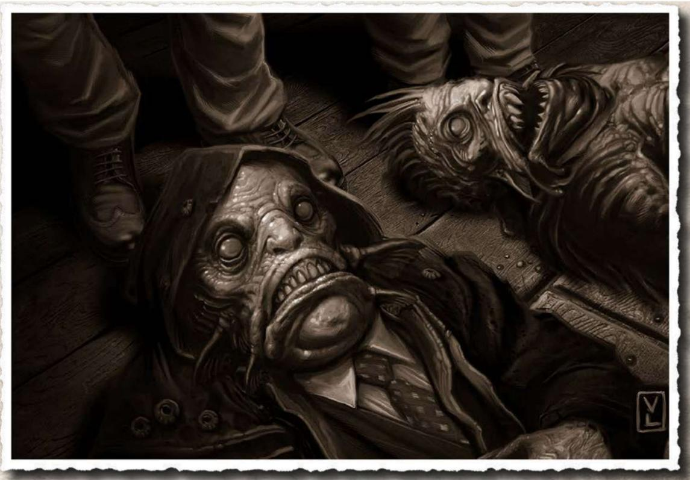

# 两栖类攻击

调查员充分调查了灯塔和小屋，或沿脚印探索了小岛并找到了特纳的尸体之后，就该让幼徒发动攻击了。外面这些杀死特纳的幼徒并不聪慧，它受混种深潜者头领的指示，在岛上漫游，搜寻金币。但时间流逝，它也意识到岛上还有别人，因此转而执行另一个指示：处理掉妨碍寻回金币的人。

# 穿过树林

调查员如果还在灌木丛里或南部码头上，聆听和侦查联合检定成功会警告他们，附近有什么在活动。当他们转向声响，去看那一闪而过的身影时，会注意到一群丑陋的类鱼生物正从树林里来，向自己进军（见怪物档案中的幼徒，第 19 页）。幼徒的数量取决于在场的调查员人数：一比一。看见这些生物触发理智检定（1/1D4 理智损失）。

守秘人笔记：如果你真的想给场面加压的话，可以让幼徒的数目超过调查员。然而考虑到调查员的技能，这些幼徒可能成为非常难缠的对手。如果战斗难以避免，还是推荐至少暂时保持数量为一比一。但如果计划诱导调查员逃向灯塔，那么数目众多的怪物应该能让他们一看就知道无望击败，立即拔腿就逃。

调查员现在面临两难：战或逃。如果要同怪物战斗，那么战斗轮正常开始。如果从战斗中幸存下来，就可以向灯塔进发，或者尝试行划艇逃走（见守秘人笔记，南部码头，第 10 页）。如果接下来去灯塔，那么守秘人可以放出更多幼徒，追击他们。

调查员如果被一大群幼徒追击的话，守秘人可以遵循追逐规则（COC 守秘人核心规则书，第七章），设置合理的障碍，妨碍逃跑。如果不用完整追逐规则，敏捷对抗检定成功就足以让调查员逃到灯塔小屋，（暂时）获得安全。调查员检定失败，会被幼徒绊上一跤，战斗或尝试挣脱（斗殴检定成功）才能逃跑。调查员如果在敏捷检定中骰出大失败或者孤注一掷失败的话，会消失在一大群幼徒的利齿下，从此人间蒸发。

# 围攻之下

如果一些调查员探索小岛时，另一些人进入灯塔的话，灯塔里的人会在同伴冲进小屋寻求庇护，魂飞魄散时，第一次得知幼徒的袭击。小屋让调查员有机会在灯塔内部暂避，想出简略的防御方案，来抵抗那些矮小而凶狠的进攻

者。调查员还没有修好那台无线电的话，可能计划这么做来求援。

守秘人笔记：如果把无光的灯塔当作一次跑完的生存恐怖模组的话，大可以让一波又一波的幼徒向调查员所在的建筑发起进攻。要么耗尽调查员的弹药和自制武器，要么放干他们的血——如果玩家就爱这么搞的话。但如果玩家不喜欢，那就别让怪物压垮调查员了，至少给他们机会活过今晚。

如果一开始众人都进了小屋，没人关前门，那么需要聆听检定成功才能在小屋内或是在通往灯房的楼梯上听到幼徒轻捷的脚步声。调查员如果关了前门的话，幼徒破门而入时木头和玻璃的碎裂声响会提醒他们，这些怪物来了。

守秘人笔记：你可能希望在调查员发现灯塔顶部的恐怖场景之前，就对小屋发动袭击。这么做幼徒会试图把调查员逼上灯塔。要么在服务室里拼死抵抗，要么在血淋淋的灯房里奋战到底。除了发电机故障（见下文）加的惩罚骰，地板湿滑加上室内拥挤，给所有灯房内战斗轮中的物理检定加一个惩罚骰。

如果发电机上方的屋顶还没修好，守秘人可以在对小屋发动攻击时，要求集体幸运检定；如果检定失败，雨势就会更猛烈，雨水从屋顶倾倒而下，使发电机短路，灯塔陷入一片黑暗。现在，任何对付幼徒的行动都会在相关检定上加一个惩罚骰。如果安排在灯房决战，那么不建议进行幸运检定，两个惩罚骰会让检定几乎无法成功。

在灯塔外的遭遇战中，每个调查员都会遇上一个幼徒。守秘人可以安排更多的怪物，依主持方式来定（见守秘人笔记，围攻之下，见上）。

虽然幼徒的生命值很少，但与生俱来的护甲和高伤害使它很难对付。如果调查员在灯房里检查尸体，发现了它的弱点，那么就可以在战斗中瞄准眼睛和腹部。调查员的攻击骰会承受一个惩罚骰，命中就意味着此次攻击无视护甲，否则伤害都必须减去护甲值。

守秘人笔记：记住，一次检定不能承受超过两个惩罚骰，而且怪物默认反击，除非它特别狡猾聪明——幼徒不是。

# 结局

如果把无光的灯塔作为生存恐怖模组来跑，那么主要

结局有二：一是调查员都死了，二是有事件把幼徒吓跑了。事件可以简单得像日出——许多优秀恐怖电影这么做——也可能是幼徒认为继续战斗得不偿失。调查员如果修好了无线电，那也可能是海岸警卫队用各种方式前来，把他们救出小岛。

如果守秘人手下留情，限制每个调查员只需要应对一两个幼徒，那么岛上（大部分）的幼徒都死了之后，没有增援，攻击就会停止。在愚角待机的混种深潜者认为一定是出了重大错误，他会撤退，重新考虑自己的计划。调查员如果举步维艰，但想办法用无线电求援了的话，海岸警卫队会在他们万念俱灰之前出现，拯救他们。

守秘人笔记：如果想让模组持续超过一小时的话，可以安排让愚角的混种深潜者带上几个幼徒，乘黄色小艇前往小岛，看看到底发生了什么，在调查员以为这次恐怖经历已经结束时恰好现身。20 页的怪物档案中可以找到混种深潜者的数据。

如果还有调查员活着，且尚余时间的话，应该允许他调查还未探索过的地方。他如果发现了卡西迪的金币收藏的话，这些就任他处置了——希望他不至于糊涂到联系印斯茅斯那的人去询问关于金币的事！

假如海岸警卫队准备施援的话，调查员应当在回答岛上发生了什么事时三思。“错误”的回答会把调查员带到大陆上接受调查局审问，作为对该地区走私活动调查的一环。奇怪的是，调查局的探员很可能相信他们的故事，和那些奇怪的鱼类生物；然而，他们会烧毁调查员的衣服，没收随身物品，并让他们起誓对 1926 年四月十二日发生的事件绝对保密。

# 奖励

奖励幸存的调查员以下理智点。如果调查员对付幼徒的方法特别有创意，守秘人可以选择奖励 $+ 1 \mathrm { D } 4$ 理智点。

. 杀死一个幼徒： $+ 1  { \mathrm { D 4 } }$ 理智点（每个调查员最多结算一次）。  
找回卡西迪的金币： $+ 1  { \mathrm { D 4 } }$ 理智点。  
从幼徒的攻击中生还： $+ 1 0 6$ 理智点。

# 后日谈

别忘了用简短的后日谈来结束模组，向玩家交代清楚未完的部分。你可以强调一下调查员取得的成功。如果调查员出售发现的金币，请描述他们设法筹集了足够现金，度过

悠长愉快的假期，好从航标岛上的可怕景象中缓过来。至于他们今后是否还能放下心来，靠近海边，那就是另一回事了…

# 怪物档案

这部分包括无光的灯塔中主要敌人的数据：有幼徒的，还有混种深潜者的，供守秘人延长模组。

# 幼徒

幼徒的头和身体和鮟鱇鱼的很相似。它有细长的刺状鳍，肌肉发达的手臂，手上有三个利爪。除此之外，它的腿像青蛙一样健壮，有鸭子一般的蹼足，还有条粗长的鳍尾。它和深潜者是远亲，但经常被误认为未成年深潜者。

模组中的幼徒来自海洋最深处，受印斯茅斯混种深潜者召唤，帮助它从乔治·卡西迪那里找回金币。

# 幼徒战术

幼徒会如饿疯了的狗一般，不计代价地追逐猎物。它不会收手，除非有上级生物指示，比如混种深潜者，或是深潜者——人类不包括在内，必须由它承认才行。幼徒在战斗中会首先转过去，背对敌人，从它的背鳍中发射出一根刺，意在用毒素使对手虚弱，之后马上发动近战攻击。

如果不把无光的灯塔当做生存恐怖模组，那么幼徒让调查员失去意识之后，可以快速转向下一个离它最近的目标。不管调查员受了重伤还是生命值归零都如此。如果调查员都失去意识了，那么幼徒会继续寻找金币，找到了就会离开。这让调查员有机会醒来，好好分析一下现状，重新制定行动方针。

# 幼徒，深海梦魇

STR 100 CON 40 SIZ 25 DEX 80 INT 10

APP — POW 40 EDU — SAN — HP 6

伤害加值： $+ 1  { \mathrm { D 4 } }$ 体格：1 移动速率：8/游泳 10

魔法值：8

战斗

每轮攻击次数：1（针刺，爪击，啃咬）

发射针刺：幼徒可以从背鳍中射出顶端带毒的刺。目标如果成功闪避就可以躲开。但目标如果对幼徒的针刺毫无防备，不知道它为何转过身来背对他们的话，那么应该在他

们的闪避骰上加一个惩罚骰。被针刺中则必须在体质检定中骰出极难成功，才不受毒素影响。这些针刺本身不会造成伤害，但其附带的毒素会很快起效，造成视线模糊以及重影，持续 $1 \mathrm { D } 6 { + 1 }$ 个战斗轮，期间受害者的所有检定都加上一个惩罚骰。在射出一根针刺之后，幼徒转为使用近战攻击。幼徒如果已经抓住受害者，或是正处在近战中，则不能使用针刺攻击。

缠咬：在啃咬攻击中骰出极难成功的幼徒会缠上受害者，先造成 $1 \mathrm { D } 3 + 1 \mathrm { D } 4$ 伤害，再于随后的每个战斗轮中造成1D3 伤害。调查员在力量检定中取得困难成功，就可以把幼徒甩到一边。同样的，附近的调查员如果在力量检定中取得困难成功，可以帮忙拉走咬住同伴的幼徒。缠咬住受害者的幼徒无法闪避，也无法发射针刺。

斗殴 $40 \%$ （20/8），伤害 $1 \mathrm { D } 3 + 1 \mathrm { D } 4$

如果幼徒的啃咬获得极难成功，它会在困难力量检定甩开它前，对受害者造成每轮 1D3的缠咬伤害。

发射针刺 $30 \%$ （15/6），见上方描述

闪避 $30 \%$ （15/6）

技能

感知猎物 $50 \%$

护甲：3 点，鳞片。瞄准幼徒眼睛或者肚皮的攻击如果成功就可以击穿护甲——此类“精准射击”在瞄准这些特定部位（肚皮或脸）时需要承受一个惩罚骰，并且只能在调查员的回合发动。

特殊能力：夜视——幼徒的视力不受黑暗影响。

理智损失：看到幼徒损失 1/1D4 点理智。

# 混种深潜者，印斯茅斯的子孙

混种深潜者是深潜者和人类交配而得的后代。它通常在降生于世时有正常婴儿的面目，但成长到十八九岁时，它的外表和生理构造就会开始变化——通常称其为“印斯茅斯式外观”。大多数这些混血儿到了中年都会变得畸形而丑陋。自此，它就会躲进家中，闭门不出。几年内，这些混血儿就会完成最终的转变，作为深潜者在大海中开始新的生活。

STR 65 CON 65 SIZ 50 DEX 65 INT 65

APP — POW 50 EDU — SAN — HP 11

伤害加值：0 体格：0 移动速率：8/游泳 8

魔法值：10

战斗

每轮攻击次数：1（徒手攻击，或者持械攻击）

混种深潜者可以和人类一样使用武器。

斗殴 $45 \%$ （22/9），伤害 1D3 或者依武器伤害定

闪避 $30 \%$ （12/5）

技能

跳跃 $45 \%$ ，聆听 $50 \%$ ，潜行 $4 6 \%$ ，游泳 $60 \%$ 。

护甲：无。

特殊能力：水下呼吸。

理智损失：看到混种深潜者损失 0/1D6 点理智。

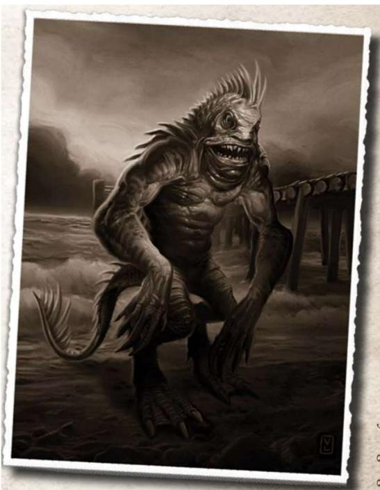